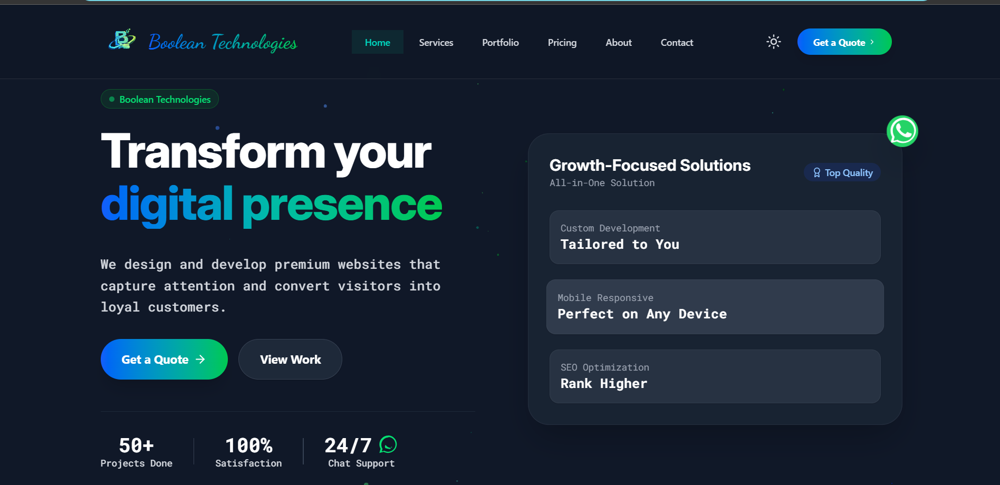
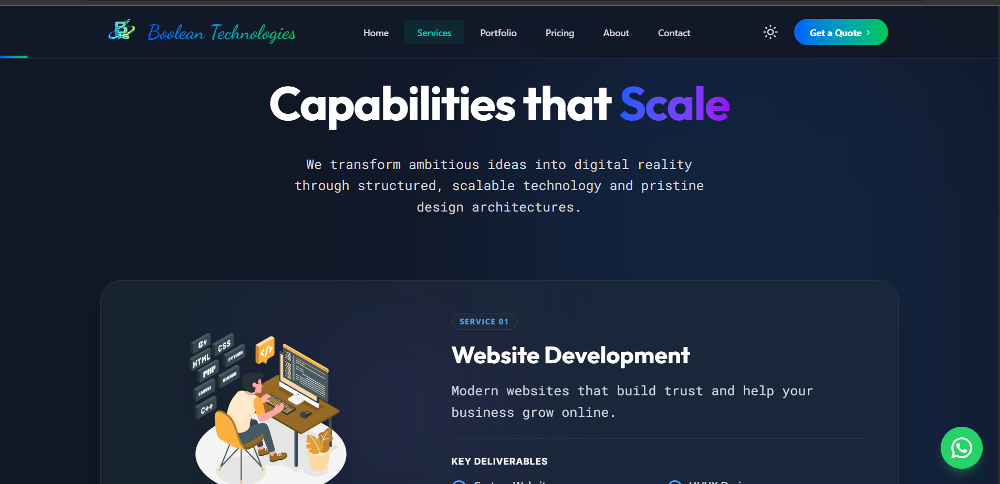
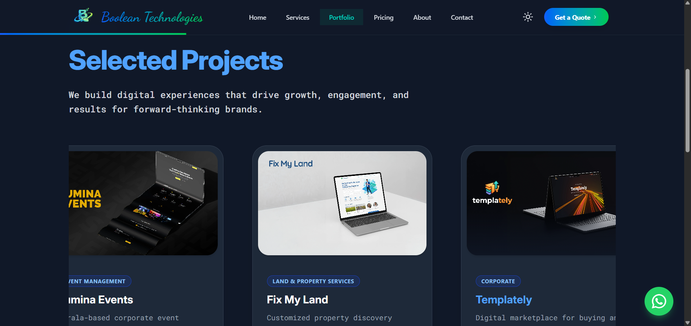
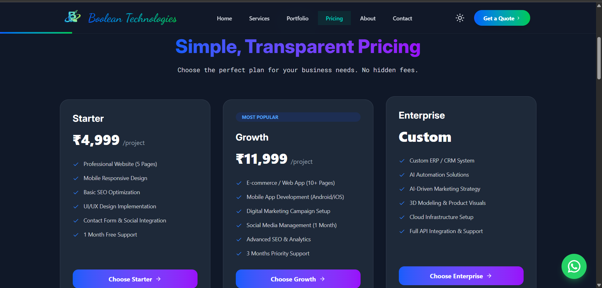
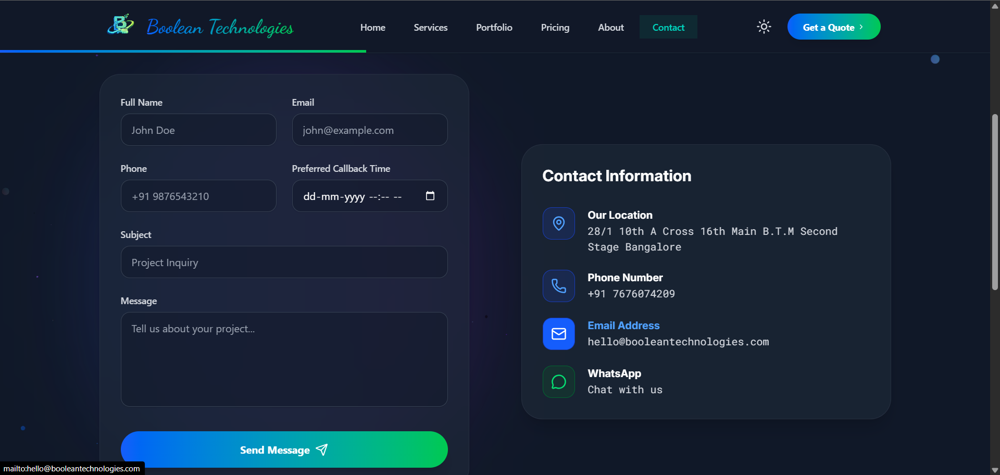

# 🌐 WebCraft Agency – Website Development Platform

**Live Demo:** [https://boolian-labs.vercel.app/](https://boolian-labs.vercel.app/)

## 📌 Overview

**WebCraft Agency** is a modern web development platform designed to showcase and deliver high-quality static and dynamic websites for businesses, product sellers, and service professionals.

This platform acts as a lead-generation website and portfolio system, offering:

-   **Static Website Development**
-   **Dynamic Web Applications**
-   **Business-Specific Solutions** (E-commerce, Real Estate, Service Industries, etc.)
-   **Secure Testimonial Management System** (Waitlist/Approval Workflow)

The primary goal is to attract clients, generate inquiries, and manage testimonials securely.

---

## 📸 Screenshots

<p align="center">
  
  <br/>
  
  <br/>
  
  <br/>
  
  <br/>
  
</p>

---

## 🚀 Features

### 🔹 Public Features
-   **Responsive Modern UI**: Full mobile and desktop compatibility with premium animations.
-   **Clean Navigation**: Intuitive, glassmorphism-style Navbar and Footer.
-   **Services Showcase**: Dedicated sections for static, dynamic, and custom solutions.
-   **Portfolio Section**: Interactive carousel with demo project links.
-   **Pricing Packages**: Clear, tiered pricing options (Basic, Standard, Premium).
-   **Contact Form**: Fully integrated backend (via EmailJS) for direct inquiries.
-   **WhatsApp Integration**: Instant messaging capability.
-   **Testimonials**: Admin-approved client feedback display.
-   **SEO Optimized**: Structured for search engine visibility.

### 🔹 Secure Contact System
-   Direct inquiry form submission.
-   Backend email notifications (Admin receives inquiry instantly).
-   Client auto-reply functionality (via EmailJS templates).

---

## 🏗 Tech Stack

### Frontend
-   **Framework**: React (Vite)
-   **Styling**: Tailwind CSS, CSS Modules
-   **Icons**: Lucide React
-   **Animations**: Framer Motion
-   **Routing**: React Router DOM (v7)
-   **Email Service**: EmailJS (Serverless contact form)

### Planned Backend Architecture (Future)
-   **Runtime**: Node.js
-   **Framework**: Express.js
-   **Database**: MongoDB (Mongoose)
-   **Auth**: JWT (Admin Authentication)
-   **Deployment**: Render / Railway (Backend), Vercel / Netlify (Frontend)

---

## 📂 Folder Structure

The project is organized in a mono-repo style with the frontend application in the `frontend` directory.

```
digital-agency/
│
├── frontend/                # React Frontend Application
│   ├── public/              # Static assets
│   ├── src/
│   │   ├── assets/          # Images and icons
│   │   ├── components/      # Reusable UI components
│   │   │   ├── Navbar.jsx
│   │   │   ├── Hero.jsx
│   │   │   ├── Services.jsx
│   │   │   ├── Portfolio.jsx
│   │   │   ├── Pricing.jsx
│   │   │   ├── Testimonials.jsx
│   │   │   ├── Contact.jsx
│   │   │   ├── Footer.jsx
│   │   │   └── ...
│   │   ├── pages/           # Page components
│   │   │   ├── Home.jsx
│   │   │   ├── ServicesPage.jsx
│   │   │   ├── PortfolioPage.jsx
│   │   │   ├── PricingPage.jsx
│   │   │   ├── AboutPage.jsx
│   │   │   └── ContactPage.jsx
│   │   ├── data/            # Static data files
│   │   │   ├── servicesData.js
│   │   │   ├── portfolioData.js
│   │   │   └── pricingData.js
│   │   ├── App.jsx          # Main application component
│   │   ├── main.jsx         # Entry point
│   │   └── index.css        # Global styles (Tailwind)
│   ├── index.html
│   ├── package.json
│   └── vite.config.js
│
├── README.md                # Project documentation
└── .gitignore               # Git ignore rules
```

---

## 📦 Installation Guide

### 1️⃣ Clone Repository
```bash
git clone https://github.com/athul457/Digital-service.git
cd Digital-service
```

### 2️⃣ Frontend Setup
Navigate to the frontend directory:
```bash
cd frontend
```

Install dependencies:
```bash
npm install
```

### 3️⃣ Environment Variables
Create a `.env` file in the `frontend` directory:
```bash
cp .env.example .env
```

Fill in your EmailJS credentials in `.env`:
```env
VITE_EMAILJS_SERVICE_ID=your_service_id
VITE_EMAILJS_TEMPLATE_ID=your_template_id
VITE_EMAILJS_PUBLIC_KEY=your_public_key
```

### 4️⃣ Start Development Server
```bash
npm run dev
```
The application will be available at `http://localhost:5173`.

---

## 🌍 Deployment Guide

### Frontend Deployment (Vercel / Netlify)
1.  Push your code to GitHub.
2.  Connect your repository to Vercel or Netlify.
3.  Set the **Root Directory** to `frontend`.
4.  Add your environment variables (`VITE_EMAILJS_...`) in the deployment dashboard settings.
5.  Deploy!

---

## 🎯 Business Goal

This platform is designed to:
-   **Generate Leads**: Convert visitors into paying clients.
-   **Build Trust**: Showcase a professional portfolio and verified testimonials.
-   **Streamline Inquiries**: Direct contact via form and WhatsApp.
-   **Scale**: Ready for backend integration (admin dashboard, CMS).

---

## 📈 Future Improvements
-   **Admin Dashboard UI**: For managing testimonials and inquiries.
-   **Blog Section**: For SEO and content marketing.
-   **Payment Integration**: Stripe / Razorpay for advance booking.
-   **Client Portal**: Project tracking system.

---

## 👨‍💻 Author

**Athul**
*MERN Stack Developer*
Specializing in business-focused website development.

---

## 📄 License
MIT License
